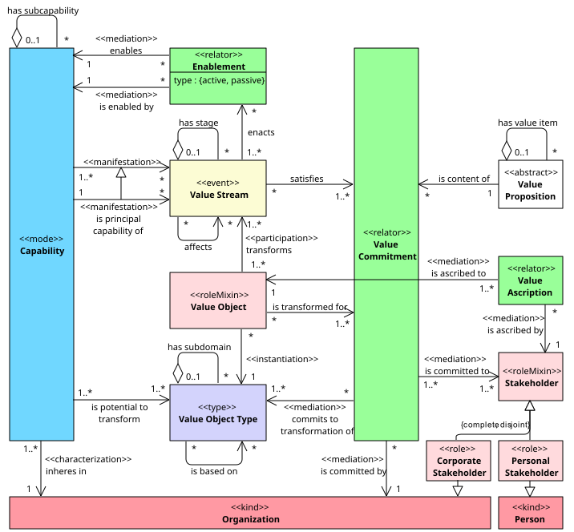

# COVO Constraints

This document provides the definitions for the 13 modeling constraints of the Capability-Object-Value Ontology (COVO).

The theoretical foundations for constraints C1–10 are established by Severin et al. in [Semantically Coherent Business Architecture Models: Integrating Capabilities, Value Streams, and Business Objects](https://www.researchgate.net/publication/401169619_Semantically_Coherent_Business_Architecture_Models_Integrating_Capabilities_Value_Streams_and_Business_Objects) (awarded Best Forum Paper at PoEM 2025). Constraints C11–13 are detailed in the follow-up paper, _Semantic Symmetry in Business Architecture: Demarcating Capability Boundaries with Object Models_ (accepted for publication).

These constraints are implemented in the open-source [COVO Validator](https://github.com/sefanja/COVO-Validator) for Archi.

## Ontological Foundation

The constraints are defined with respect to the core elements (`Capability`, `Value Object`, `Value Stream`) and their relationships depicted in the OntoUML diagram.

In essence, the model represents that an `Organization` manifests its `Capabilities` through `Value Streams`, which transform `Value Objects` to satisfy `Value Commitments` to `Stakeholders`.

## Definitions

Since enterprise architecture models typically operate at the type level, we adopt the convention of using the terms _value object_ and _value stream_ as shorthands for their respective type-level constructs.

We represent a business capability model $M$ as a relational structure $M = (E, R)$, where:

* $E = C \cup O \cup S$ is a set of elements, such that:
  * $C$ is a set of _capabilities_
  * $O$ is a set of _value object types_
  * $S$ is a set of _value streams_
* $R$ is a set of binary relations, partitioned into disjoint sets $V$ and $H$, such that:
  * $V$ is the set of vertical relations $\\{ \texttt{isRefinedBy} \\}$, where:
    * $\texttt{isRefinedBy} \subseteq (C \times C) \cup (O \times O) \cup (S \times S)$ denotes the _has subcapability_, _has subdomain_, and _has stage_ relationships
  * $H$ is the set of horizontal relations $\\{ \texttt{affects}, \texttt{enables}, \texttt{isBasedOn}, \texttt{principal}, \texttt{canTransform} \\}$, where:
    * $\texttt{affects} \subseteq S \times S$ denotes the _affects_ relationship on _value streams_
    * $\texttt{enables} \subseteq C \times C$ denotes the _enables_ relationship on _capabilities_
    * $\texttt{isBasedOn} \subseteq O \times O$ denotes the _is based on_ relationship on _value object types_
    * $\texttt{isManifestedIn} \subseteq C \times S$ denotes the _is manifested in_ relationship from _capability_ to _value stream_
    * $\texttt{principal} \subseteq \texttt{isManifestedIn}$ denotes the _is principal capability of_ relationship from _capability_ to _value stream_
    * $\texttt{canTransform} \subseteq C \times O$ denotes the _is ability to transform_ relationship from _capability_ to _value object type_

Furthermore:

* Let $\texttt{isLeaf}(e)$ be defined as an element with no children: $\texttt{isLeaf}(e) \iff \neg \exists e' \in E: \texttt{isRefinedBy}(e, e')$.
* Let $\texttt{depth}(e)$ be a function that yields the total number of ancestors of $e$.
* Let $R^∗$ denote the reflexive transitive closure of a relation $R$, and $R^+$ denote the transitive closure (one or more steps).
* Let $\texttt{refines} \subseteq (C \times C) \cup (O \times O) \cup (S \times S)$ be a relation such that $(y, x) \in \texttt{refines} \iff (x, y) \in \texttt{isRefinedBy}$.

For a model $M$ to be COVO-compliant, the following constraints must hold:

## Hierarchical consistency (C1-5)

These modeling constraints ensure that capabilities, objects and value streams are modeled in valid part-whole hierarchies that enable consistent zooming. We refer to elements in these hierarchies as parents, children, and ancestors. Note that hierarchical (or 'vertical') relationships are only allowed between elements of the same type (e.g., not between capability and object).

### C1. Unique parent

Each element has at most one parent. _Rationale:_ This ensures a single, unambiguous position for every element in the hierarchy.

> $$
> \forall e, p_1, p_2 \in E : \texttt{isRefinedBy}(p_1, e) \land \texttt{isRefinedBy}(p_2, e) \implies p_1 = p_2
> $$

### C2. Acyclicity

An element cannot be its own ancestor. _Rationale:_ This prevents ill-defined, circular refinement structures.

> $$
> \neg \exists e \in E : \texttt{isRefinedBy}^{+}(e, e)
> $$

### C3. Consistent refinement depth

All leaf elements (elements without children) must have the same number of ancestors. _Rationale:_ This prevents incomplete levels of detail, which create both structural gaps and semantic ambiguity. An unbalanced model leaves the meaning of its most detailed elements unclear, as their defining peer group is incomplete.

> $$
> \forall e_1, e_2 \in E : \texttt{isLeaf}(e_1) \land \texttt{isLeaf}(e_2) \implies \texttt{depth}(e_1) = \texttt{depth}(e_2)
> $$

### C4. Upward coherence

A non-hierarchical relationship between two elements requires a corresponding relationship between their parents (if any), provided the parents are distinct. _Exception:_ A relationship does not need to propagate if:

1. it is a relationship between objects (as structural propagation is handled implicitly via rules C11-12);
2. the parent elements are both principal capabilities within the same top-level value stream (to prevent redundant propagation of _enables_ relationships to higher levels);
3. it is an _is manifested in_ relationship between a capability and a value stream, while their parents are not connected through a chain of _enables_ and _is principal capability of_;
4. propagation would introduce an _affects_ or _enables_ cycle (to maintain a forward, value-directed path); or
5. propagation would introduce a redundant _affects_ path (e.g., an edge $A \rightarrow C$ that is already implied by reachability via $A \rightarrow B \rightarrow C$, allowing for compact models).

_Rationale:_ This ensures that low-level relationships are reflected at higher levels of abstraction. The exception allows lower-level support relationships to remain implicit at higher levels. This aligns with the principle that value streams represent simplified views of value creation rather than detailed process models.

> $$
> \begin{aligned}
>   & \forall \texttt{h} \in H, e_1, e_2, p_1, p_2 \in E : \texttt{h}(e_1, e_2) \land \texttt{isRefinedBy}(p_1, e_1) \land \texttt{isRefinedBy}(p_2, e_2) \implies \\
>   & \texttt{h}(p_1, p_2) \lor p_1 = p_2 \lor {} \\
>   & \left\\{ \begin{aligned}
>     {\scriptscriptstyle \texttt{(1) }} & e_1, e_2 \in O \\
>     {\scriptscriptstyle \texttt{(2) }} & \exists s \in S : (\texttt{principal} \circ \texttt{refines}^{\*})(p_1, s) \land (\texttt{principal} \circ \texttt{refines}^{\*})(p_2, s) \\
>     {\scriptscriptstyle \texttt{(3) }} & \neg (\texttt{enables}^{\*} \circ \texttt{principal})(p_1, p_2) \\
>     {\scriptscriptstyle \texttt{(4) }} & \texttt{enables}^{+}(p_2, p_1) \lor \texttt{affects}^{+}(p_2, p_1) \\
>     {\scriptscriptstyle \texttt{(5) }} & (\texttt{affects} \circ \texttt{affects}^{+})(p_1, p_2)
>   \end{aligned} \right.
> \end{aligned}
> $$

### C5. Downward coherence

A relationship between two parent elements requires that at least one pair of their respective children (if any) is also related. _Rationale:_ This ensures that high-level relationships are grounded in more detailed, concrete relations.

> $$
> \begin{aligned}
>   & \forall \texttt{h} \in H, e_1, e_2 \in E : \texttt{h}(e_1, e_2) \implies \\
>   & ( \texttt{isRefinedBy} \circ \texttt{h} \circ \texttt{refines} )(e_1, e_2) \lor \big( \texttt{isLeaf}(e_1) \land \texttt{isLeaf}(e_2) \big)
> \end{aligned}
> $$

## Cross-perspective alignment (C6-10)

These constraints ensure that the three perspectives (capability, object, value stream) remain aligned, forming a coherent triad.

### C6. Capability impact

Each capability transforms exactly one object. _Exception:_ At the leaf-level, a capability may transform multiple objects. _Rationale:_ This ensures that every capability has a well-defined, non-overlapping impact on value creation. The exception prevents artificial fragmentation of what the business considers a single cohesive capability.

> $$
> \begin{aligned}
> & \forall c \in C : \\
> & \big( \neg \texttt{isLeaf}(c) \implies \exists! o \in O : \texttt{canTransform}(c, o) \big) \land {} \\
> & \big( \texttt{isLeaf}(c) \implies \exists o \in O : \texttt{canTransform}(c, o) \big)
> \end{aligned}
> $$

### C7. Object relevance

Each object must be transformed by exactly one capability. _Exception:_ At the leaf-level, an object may be transformed by multiple capabilities. _Rationale:_ This ensures clear relevancy and accountability for the object in value-creating activities. The exception prioritizes the conceptual stability of objects as recognized by stakeholders. It avoids the need to decompose a familiar object into numerous, fine-grained lifecycle states (e.g., 'Submitted Order', 'Validated Order'), which would compromise the model's readability.

> $$
> \begin{aligned}
> & \forall o \in O : \\
> & \big( \neg \texttt{isLeaf}(o) \implies \exists! c \in C : \texttt{canTransform}(c, o) \big) \land {} \\
> & \big( \texttt{isLeaf}(o) \implies \exists c \in C : \texttt{canTransform}(c, o) \big)
> \end{aligned}
> $$

### C8. Capability purpose

Each capability must manifest in a value stream. _Rationale:_ This guarantees that all potential is ultimately linked to a value-creating purpose.

> $$
> \forall c \in C \\; \exists s \in S : \texttt{isManifestedIn} (c, s)
> $$

### C9. Traceability

Each value stream must manifest exactly one principal capability. _Rationale:_ This constraint ensures traceability and governability. It establishes a clear, unambiguous link from value-creating action back to the accountable capability.

> $$
> \forall s \in S \\; \exists! c \in C : \texttt{principal}(c, s)
> $$

### C10. Exclusive manifestation

Each capability may manifest only once per top-level value stream as a principal capability. _Exception:_ This constraint does not apply at the  leaf-level. _Rationale:_ This prevents a granularity mismatch between value streams and capabilities. The exception at the leaf-level avoids the artificial discrimination between near-identical capabilities.

> $$
> \begin{aligned}  
> & \forall c \in C, s \in S : \texttt{principal}(c, s_1) \land \texttt{principal}(c, s_2) \land s_1 \neq s_2 \implies \\
> & \neg ( \texttt{refines}^{\*} \circ \texttt{isRefinedBy}^{\*} )(s_1, s_2) \lor \texttt{isLeaf}(c)  
> \end{aligned}
> $$

## Semantic symmetry (C11-13)

These modeling constraints implement the semantic symmetry principle: any behavioral dependency (between capabilities and/or value streams) must be mirrored by a structural dependency (between their corresponding objects).

### C11. Grounded value stream dependencies

Each _affects_ relationship between two value stream stages must have an _is based on_ relationship between the objects (if distinct) transformed by the principal capabilities of those stages. _Rationale:_ An _affects_ relationship implies that the outcome of the first stage determines the object state that can be reached in the second. Therefore, the object of the second stage must depend on the object of the first.

> $$
> \begin{aligned}
>   & \forall s_1, s_2 \in S : \texttt{affects}(s_1, s_2) \implies \exists o_1, o_2 \in O : \\
>   & ( \texttt{principal}^{-1} \circ \texttt{canTransform} )(s_1, o_1) \land {} \\
>   & ( \texttt{principal}^{-1} \circ \texttt{canTransform} )(s_2, o_2) \land {} \\
>   & \big( \texttt{isBasedOn}(o_2, o_1) \lor o_1 = o_2 \big)
> \end{aligned}
> $$

### C12. Grounded capability dependencies

Each _enables_ relationship between two capabilities must have a corresponding _is based on_ relationship between their respective objects (if distinct). _Rationale:_ An _enables_ relationship states that the enabling capability provides a necessary precondition for the enabled capability's effective manifestation. Therefore, the object transformed by the enabled capability must have its states delimited by (i.e., _be based on_) the object transformed by the enabling capability.

> $$
> \begin{aligned}
>   & \forall c_1, c_2 \in C : \texttt{enables}(c_1, c_2) \implies \exists o_1, o_2 \in O : \\
>   & \texttt{canTransform}(c_1, o_1) \land \texttt{canTransform}(c_2, o_2) \land {} \\
>   & \big( \texttt{isBasedOn}(o_2, o_1) \lor o_1 = o_2 \big)
> \end{aligned}
> $$

## C13. Justified object dependencies

An _is based on_ relationship between two objects is only permitted if it is justified by one of the following conditions: (i) the objects are transformed by the same capability, (ii) the objects are transformed by capabilities with an _enables_ relationship (per C12), or (iii) the objects are transformed by the principal capabilities of value stream stages with an _affects_ relationship (per C11). _Rationale:_ While C11 and C12 prevent ungrounded behavioral dependencies, C13 ensures the reverse: that no object dependency is ignored by the behavioral design.

> $$
> \begin{aligned}
>   & \forall o_1, o_2 \in O : \texttt{isBasedOn}(o_2, o_1) \implies \exists c_1, c_2 \in C : \\
>   & \texttt{canTransform}(c_1, o_1) \land \texttt{canTransform}(c_2, o_2) \land {} \\
>   & \left\\{ \begin{aligned}
>     {\scriptscriptstyle \texttt{(i) }} & c_1 = c_2 \lor {} \\
>     {\scriptscriptstyle \texttt{(ii) }} & \texttt{enables}(c_1, c_2) \lor {} \\
>     {\scriptscriptstyle \texttt{(iii) }} & ( \texttt{principal} \circ \texttt{affects} \circ \texttt{principal}^{-1} )(c_1, c_2)
>   \end{aligned} \right.
> \end{aligned}
> $$
